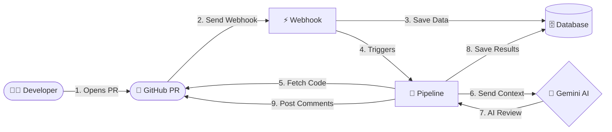

# ⚡ PR Reviewer — AI-Powered GitHub Code Review


An automated code review system that analyzes GitHub Pull Requests using Google Gemini and posts inline comments directly on the PR.

---

## 🚀 How It Works

**What problem does this solve?**
Code reviews take time and context. PR Reviewer automatically acts as a first-pass reviewer, instantly analyzing changed code, detecting bugs, and leaving actionable inline comments before a human ever has to look at it.

### 🏗️ Architecture of this Project

Here is a simplified, high-level overview of how the PR Reviewer system works from start to finish:



---

## 🛠 Tech Stack

| Layer      | Technology                          |
|------------|-------------------------------------|
| Backend    | Java 21, Spring Boot 3.3, Maven     |
| Frontend   | React 18, Vite, Tailwind CSS, Axios |
| Database   | PostgreSQL (Neon), Flyway, JPA      |
| AI         | Google Gemini API                   |
| Auth       | GitHub OAuth2                       |

---

## 📄 Documentation

For a deep dive into the system, see the following files:
- [Architecture Overview](ARCHITECTURE.md)
- [API Reference](API.md)
- [Phase 1 Completion Criteria](PHASE1_CRITERIA.md)
- [Future Enhancements Roadmap](FUTURE_ENHANCEMENTS.md)

---

## ⚙️ Environment Variables

Copy `.env.example` to `.env` and fill in real values:

| Variable               | Description                                |
|------------------------|--------------------------------------------|
| `DATABASE_URL`         | PostgreSQL JDBC URL (Neon)                 |
| `DATABASE_USERNAME`    | Database username                          |
| `DATABASE_PASSWORD`    | Database password                          |
| `GITHUB_CLIENT_ID`     | GitHub OAuth App Client ID                 |
| `GITHUB_CLIENT_SECRET` | GitHub OAuth App Client Secret             |
| `GITHUB_WEBHOOK_SECRET`| Webhook secret set when registering webhook|
| `GEMINI_API_KEY`       | Google Gemini API key                      |
| `FRONTEND_URL`         | Frontend origin URL for CORS               |

---

## 🏃 Running Locally

### Prerequisites
- Java 21+
- Node.js 18+
- PostgreSQL (or Neon account)
- GitHub OAuth App
- Gemini API key

### Backend

```bash
# Copy and fill environment file
cp .env.example .env

# Run with environment variables
export $(cat .env | xargs)
./mvnw spring-boot:run
```

Backend runs on: `http://localhost:8080`

### Frontend

```bash
cd frontend
npm install
npm run dev
```

Frontend runs on: `http://localhost:5173`

---

## 🔑 GitHub OAuth App Setup

1. Go to **GitHub → Settings → Developer Settings → OAuth Apps → New OAuth App**
2. Homepage URL: `http://localhost:5173` (or your frontend URL)
3. Authorization callback URL: `http://localhost:8080/login/oauth2/code/github`
4. Copy Client ID and Secret to `.env`

---

## 🪝 Webhook Setup

1. Go to your repository → **Settings → Webhooks → Add webhook**
2. Payload URL: `https://your-backend.render.com/webhook/github`
3. Content type: `application/json`
4. Secret: set a strong random secret, add to `.GITHUB_WEBHOOK_SECRET` env var
5. Events: select **Pull requests**
